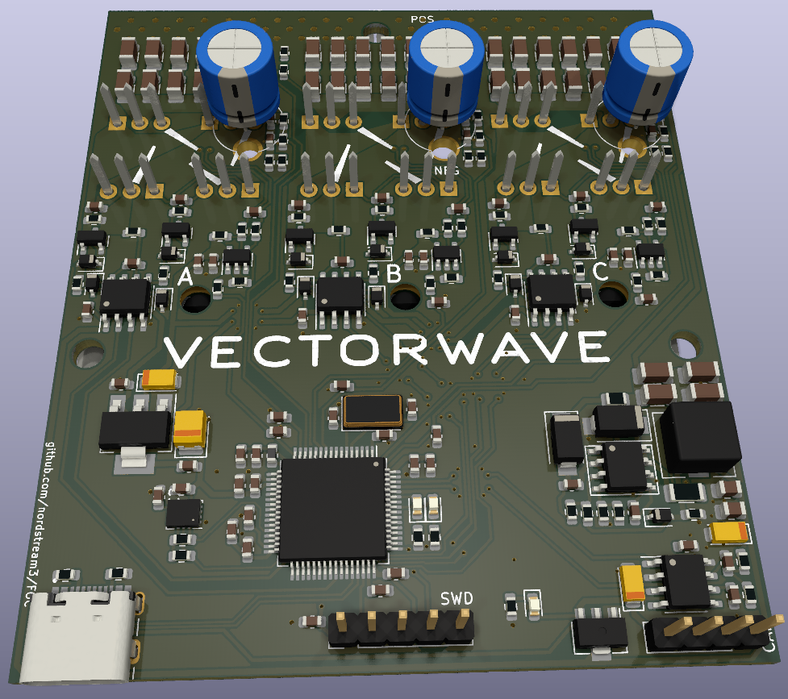

# VECTORWAVE

# The DIY Open Source Vesc6 and FOC capable HW

VECTORWAVE is an open-source motor controller board in development based on a JLCPCB friendly [VESC6 75V/300A](https://vesc-project.com/sites/default/files/Benjamin%20Posts/vesc_75_300.pdf) so-called "driverless" design with individual gate drivers for all three phases. It is powered by an STM32F405 CPU and is capable of running Field Oriented Control at high power and voltages.

## Features
* 75V/150A continuous rating
* 3-phase FOC motor control
* 2-layer smd design with individual gate drivers for all three phases
* STM32F405 CPU
* Onboard IMU
* Compact design with double-up on fets and shunts mounted on the bottom side
* 12V for gate drivers, 5V for USB-C and IMU, and 3.3V for CPU and op-amped current-sense amplification
* Cheap and always up-to-date with cheapest and **well stocked** components available for ordering at [JLCPCB](https://jlcpcb.com/) and [LCSC](https://www.lcsc.com)

## Getting Started
Prerequisites
To use VECTORWAVE, you will need the following:

* To wait for the Official Realease announcement
* A brushless motor
* A power source capable of supplying up to 75V and 150A. Minimum voltage is 12V
* A USB cable to connect to a computer for programming and configuration
* Motor control software, such as the VESC firmware

## Installation
To install the VECTORWAVE board, follow these steps:

* Order the PCB from JLCPCB using the provided gerber files
* JLCPCB can offer the service of mounting all components, with the exception of shunts and mosfets
* Purchase the necessary components (BOM available in the repository)
* Solder the remaining components onto the PCB
* Program the firmware onto the board using a programmer (JTAG or Stm32f4Discovery)
* Connect the motor, power source, and USB cable

## Usage
After installation, use the VESC Tool to configure the motor controller according to your specific motor and application requirements.

## Contributions
Contributions to the VECTORWAVE project are welcome and encouraged. If you have any suggestions or improvements, please open an issue or a pull request on the GitHub repository.

## Donate
If you find this project useful and would like to support bread-and-butter for very time consuming development and maintenance, you can [donate 1$](https://www.paypal.com/donate/?business=R5QUC7RNEPKDC&no_recurring=0&item_name=A+small+but+important+contribution+for+Development+and+Maintenance.+Thank+You+very+much.&currency_code=USD) to the creator via [PayPal](https://www.paypal.com/donate/?business=R5QUC7RNEPKDC&no_recurring=0&item_name=A+small+but+important+contribution+for+Development+and+Maintenance.+Thank+You+very+much.&currency_code=USD).

## License
VECTORWAVE is released under the MIT License. See the LICENSE file for more information.

## Acknowledgements
VECTORWAVE is built on the work of the [VESC project](https://github.com/vedderb/bldc) and the contributions of its developers and contributors. Also this project is very much inspired by the [Cheap Focer2](https://github.com/shamansystems/Cheap-FOCer-2/blob/Developer-Branch/README.md) by SHAMAN.
