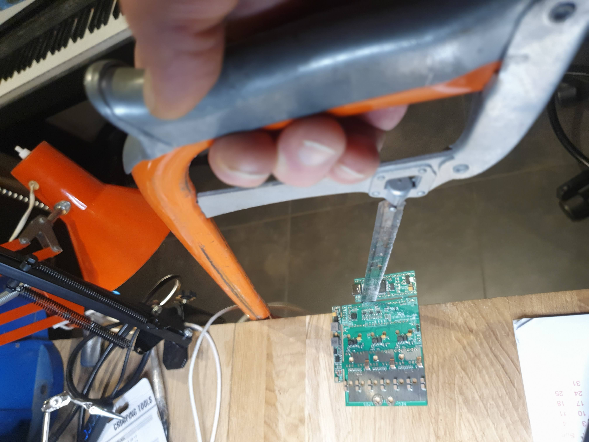
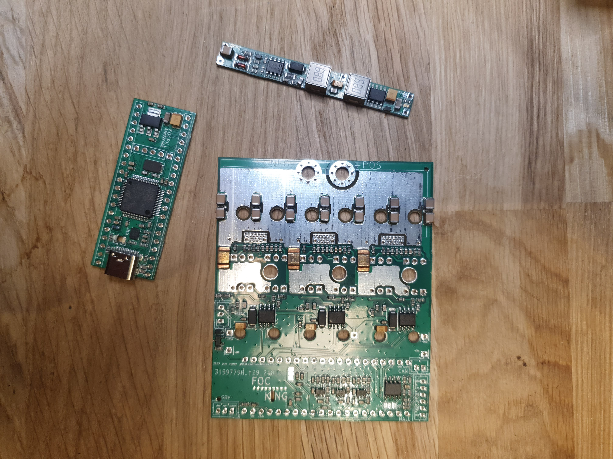
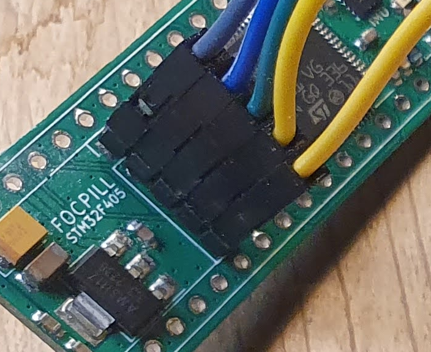
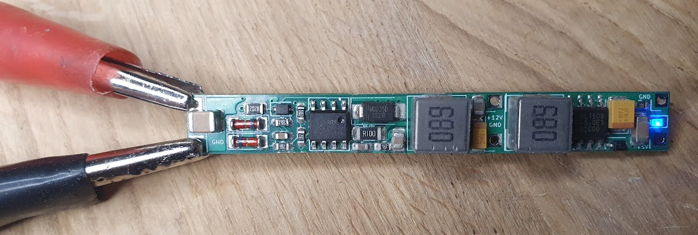
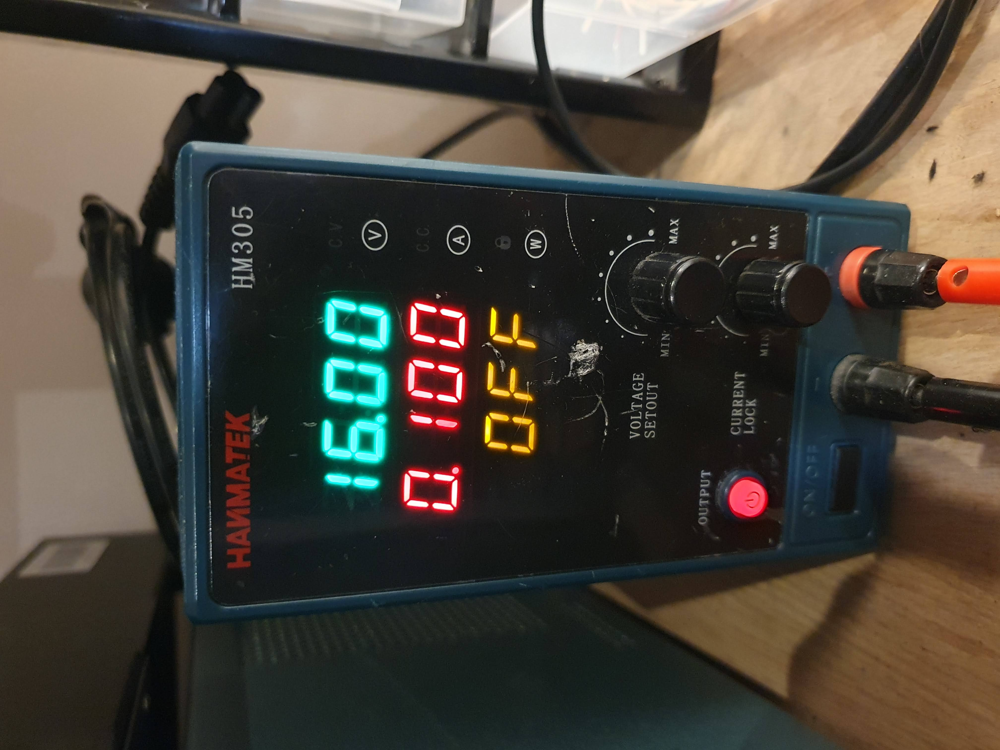
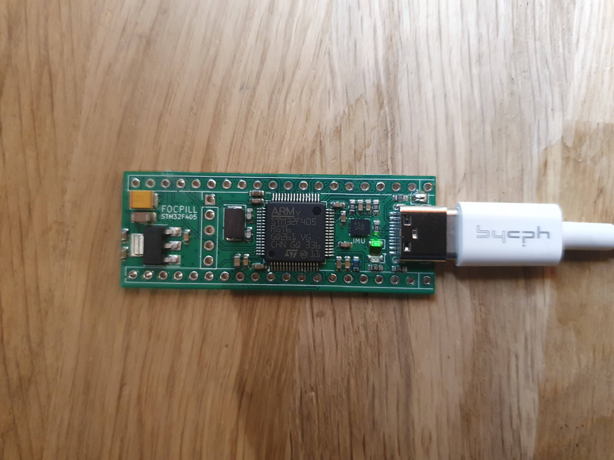

# Assembly Guide

The board is produced by the manufacturer as a single pcb. The 3 modules are connected by taps, which you will need to separate using a manual saw. JLCPCB will charge you for the number of designs, but this is a single design assembled to a single unit. The separation is just for convenience purposes and none of the modules will work on their own.

<div>



</div>

Use a suitable manual hand saw for separating the 3 modules. Be careful not to damage the traces on the FOCPILL and POWER modules in particular, as the traces here are close to the edges.

When the modules are separated you should straighten the edges with sandpaper or a file.

## How to avoid creating solder bridges and other errors by testing throughout the assembly
Any error that you accidentally introduce to the board is really not a big deal, as long as you catch the error early on. This is why it is very important to verify the hardware after each step in the assembly. Test or you will regret that you didn't!


## Step 1: Uploading Firmware and testing the FOC/PILL

The FOCPILL can be powered from USB +5V by temporarily bridging the two pads next to the USB-C connector.

<div>


</div>

Now, Connect the FOC/PILL via a USB-C cable to your computer. In this example I use a STM32F4 Discovery board for uploading firmware, but there are other options available:

[Existing VESC hardware](https://www.youtube.com/watch?v=PFFiVxFHDM4&t=312s)

[stm32f4 Discovery](https://geekilyinteresting.wordpress.com/2014/05/04/using-your-stm32f4-discovery-board-as-a-programmer-and-debugger/)

[ST-LINK windows](https://www.youtube.com/watch?v=etglJKNJSCY)

[stlink-gui on Ubuntu Linux](https://www.youtube.com/watch?v=VhLIKFwoGjo)

<div>


</div>

There is no specific need for soldering pin-headers to the SWD terminals. Usually you only need a connection for a few seconds, and just applying a bit of tension to the terminals during the upload is enough. The pill is going to be soldered to the bottom side of the main module, and permanent pin-headers are not convenient on this side of the board.

Info: The square pad on the pill SWD header is VCC (+3.3V).

In this example I use "stlink-gui" on Linux for uploading firmware. If you're on Widows or Mac use one of the other options.

Flash the bootloader to address 0x08000000. Bootloader can be found in the "binaries" folder.


Next, flash the Vesc firmware, also to address 0x08000000. Can also be found in the "binaries" folder.


Once you have flashed the firmware and the FOC/PILL is booted, the LEDs on the board will show a constant green light and a blinking red light. You should be able to discover the board in Vesc Tool under the name "FOC_KING".

<div>


</div>


**REMEMBER** to remove the solder bridge between the pads again, as the assembled FOCKING will **NOT** work properly if powered by USB.

## Step 2: Verify the POWER hardware

Connect the Power Module to a power supply as shown on the image below. Be VERY careful not to short the connections. Set the voltage to +16V with a **current limit of 0.1 Amps**.

<div>


</div>

The module is working properly when the LED on the module shows a constant blue light.

## Solder power connector pins

Solder 5 power connector pins onto the Main Module.

[image of soldered power connectors]

You can now temporarily attact the Power Module to the Main Module. You can bend the pins slightly in order to secure a good connection. Do not solder the two modules together yet.

[image of tmp connected modules - with blue light]

If you apply min. +16V to the main connectors on the Main Module, the blue LED on the Power Module should light up. Still **current limit of 0.1 Amps**.

## Step 3: Connect FOCPILL and Main Module together

In general you can connect these modules with or without pin-headers, but there are a few terminals that should always be connected by pins. These are:

GND
| ------------- |
| +3V      |
| +5V      |

In particular, the GND terminals are very difficult to heat to sufficient temperatures for any solid connection, without using pins. But if we look at the pcb, these terminals are located under JST connectors, which already are "pinned".

Start by aligning the modules so the FOC/PILL is located on the back-side of the MAiN module. Place the associated JST connectors in their right positions on the front side of the main module, and solder the connector pins on the back side. Be careful not to use more than just enough solder for these pins.


If this is your first time assembling a board, I advise you to connect the modules using 2.54mm pitch pin headers.
**current limit of 0.1 Amps**





# Markdown syntax guide

## Headers

# This is a Heading h1
## This is a Heading h2
###### This is a Heading h6

## Emphasis

*This text will be italic*  
_This will also be italic_

**This text will be bold**  
__This will also be bold__

_You **can** combine them_

## Lists

### Unordered

* Item 1
* Item 2
* Item 2a
* Item 2b

### Ordered

1. Item 1
2. Item 2
3. Item 3
    1. Item 3a
    2. Item 3b

## Images


## Links

You may be using [Markdown Live Preview](https://markdownlivepreview.com/).

## Blockquotes

> Markdown is a lightweight markup language with plain-text-formatting syntax, created in 2004 by John Gruber with Aaron Swartz.
>
>> Markdown is often used to format readme files, for writing messages in online discussion forums, and to create rich text using a plain text editor.

## Tables

| Left columns  | Right columns |
| ------------- |:-------------:|
| left foo      | right foo     |
| left bar      | right bar     |
| left baz      | right baz     |

## Blocks of code

```
let message = 'Hello world';
alert(message);
```

## Inline code

This web site is using `markedjs/marked`.
