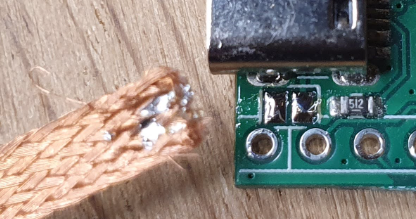
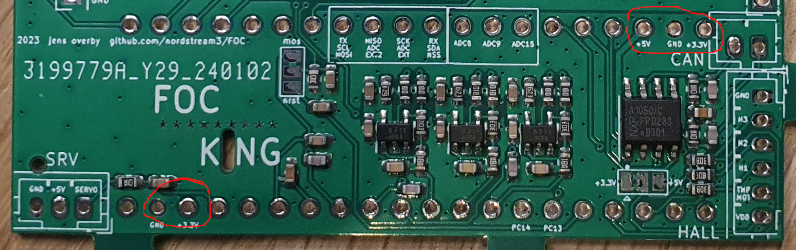

# Assembly Guide

The board is produced by the manufacturer as a single pcb. The 3 modules are connected by taps, and you will need to separate the modules using a manual saw. JLCPCB will charge you for the number of designs on a pcb, but this is a single design where the modules are going to be assembled to a single unit. The separation is just for convenience purposes and none of the modules will work on their own.

<div>


</div>

Use a suitable manual hand saw for separating the 3 modules. Be careful not to damage the traces on the FOCPILL and POWER modules in particular, as the traces here are close to the edges.

When the modules are separated you should straighten the edges with sandpaper or a file.

## How to avoid creating solder bridges and other errors by testing throughout the Assembly Procedure
Any error that you accidentally introduce to the board is really not a big deal, as long as you catch the error early on. This is why it is very important to verify the hardware after each step in the assembly.

Test or you will regret that you didn't!
| -------- |


## Step 1: Uploading Firmware and testing the FOC/PILL

The FOCPILL can be powered from USB +5V by temporarily bridging the two pads next to the USB-C connector.

<div>


</div>

Now, Connect the FOC/PILL via a USB-C cable to your computer. In this example I use a STM32F4 Discovery board for uploading firmware, but there are other options available:

[Existing VESC hardware](https://www.youtube.com/watch?v=PFFiVxFHDM4&t=312s)

[stm32f4 Discovery](https://geekilyinteresting.wordpress.com/2014/05/04/using-your-stm32f4-discovery-board-as-a-programmer-and-debugger/)

[ST-LINK windows](https://www.youtube.com/watch?v=etglJKNJSCY)

[stlink-gui on Ubuntu Linux](https://www.youtube.com/watch?v=VhLIKFwoGjo)

<div>


</div>

There is no specific need for soldering pin-headers to the SWD terminals. Usually you only need a connection for a few seconds, and just applying a bit of tension to the terminals during the upload is enough. The pill is going to be soldered to the bottom side of the main module, and permanent pin-headers are not convenient on this side of the board.

Info: The square pad on the pill SWD header is VCC (+3.3V).

In this example I use "stlink-gui" on Linux for uploading firmware. If you're on Widows or Mac use one of the other options.

Flash the bootloader to address 0x08000000. Bootloader can be found in the "binaries" folder.


Next, flash the Vesc firmware, also to address 0x08000000. Can also be found in the "binaries" folder.


Once you have flashed the firmware and the FOC/PILL is booted, the LEDs on the board will show a constant green light and a blinking red light. You should be able to discover the board in the Vesc Tool under the name "FOC_KING".

<div>


</div>


**REMEMBER** to remove the solder bridge between the pads again, as the assembled FOCKING will **NOT** work properly if powered by USB.

<div>

</div>


## Step 2: Verify the POWER hardware

Connect the Power Module to a power supply as shown on the image below. Be VERY careful not to short the connections. Set the voltage to +16V with a **current limit of 0.1 Amps**.

<div>


</div>

The module is working properly when the LED on the module shows a constant blue light.

## Step 3A: Connect FOCPILL and Main Module together

In general you can connect these modules with or without pin-headers, but there are a few terminals that should always be connected by pins. These are:

GND
| ------------- |
| +3V      |
| +5V      |

In particular, the GND terminals are very difficult to heat to sufficient temperatures, without using pins. But if we look at the pcb, these terminals are all conveniently located under JST connectors, which already are "pinned".



1. Start by aligning the modules so the FOC/PILL is located on the back-side of the MAIN module. Place the associated JST connectors in their right positions on the front side of the main module, and solder the connector pins on the back side. Be careful not to use more than just enough solder for these pins.
2. Fix the modules by soldering a single pin-hole, and make sure that you use a fair amount of solder and heat, and make sure that there is virtually NO gap between the modules. The more of a gap the more difficult the whole mounting procedure will be.
3. When the modules are fixed together with solder at a single pin-hole, you should temporarily remove the plastic socket of the JST connectors, using e.g. a hobby knife or pliers.
4. Now you can solder the exposed JST pins on the front side of the main module. Carefully, you can re-attach the plastic sockets on their corresponding pins.

1 | 2 | 3 | 4
| --- | --- | --- | --- |
image | image | image | image


## Step 3B (no pin headers):
If you're going to connect all terminals using pin-headers, you can jump to "Step 3C" now.

The easiest way to solder the remaining terminals (those without pin-headers) is to secure the soldering iron in a vise, align the pin-hole on top of the soldering iron, holding the workpiece with one hand and apply solder with the other as shown below.

[image]

This is the best way to achieve solid electrical connections between the pin-holes of the sandwiched modules.

Jump to "Step 4".

## Step 3C: (all pin headers)

Align pin-headers in the remaining pin-holes and solder these on the opposite side. Then remove the plastic spacers using e.g. a knife, and solder the pins to this side of the board too. Be careful not to use too much solder, as this will make it difficult to un-solder the foc/pill, if you for any reason would like to do that later on.

<div>


</div>

## Step 4: Solder power connector pins

Solder 5 power connector pins onto the Main Module.

[image of soldered power connectors]

You can now temporarily attact the Power Module to the Main Module. You can bend the pins slightly in order to secure a good connection. Do not solder the two modules together yet.

[image of tmp connected modules - with blue light]


Now that all three modules are connected (power module connected by tension only), you should be able to power the complete board by applying +16V across the main supply terminals. **Use a current limit of 0.1A**.

<div>


</div>

At this stage, the board should draw around 0.05A at 16V.

## Step 5: Apply solder to exposed copper planes

Apply around 0.3-0.5 of solder to the large exposed copper planes of both sides of the Main Module (however, not anything yet to the "phase" planes in between the mosfets). Also apply around the same amount to the small temperature sensor plane on the bottom of the Main Module. This, because there will be around 0.5mm of gap between mosfets and pcb.

<div>


</div>

## Step 6: Solder first 6 mosfets

Bend the legs of these 6 mosfets in such a way that there is a spacing of around 0.5mm between mosfets and pcb. In other words, we want the screw-holes for attaching mosfets to the aluminum heat sink to be not too much off. Also, the USB connector should not be in the way of an aluminum heat-sink.

[image of mosfet-2-pcb gap]


You choose if you want to attach the remaining 6 mosfets. This obviously depends on the wattage spec you want of the board.

Power up the complete board by applying +16V across the main supply terminals. **Use a current limit of 0.1A**.


The board should obviously draw less than 0.1A - probably around 0.05A.

## Step 7: Solder the wires for main supply positive and negative. Also solder wires for all three phases

[Image]

Attach a bldc motor to the three phase wires.

Again, apply the same test as in "Step 6"

## Step 8: Running the motor, testing

If you were successful so far, increase the voltage to +24V and **set a current limit of 0.3A**.
Connect to "FOC_KING" in the Vesc Tool and go to the "Vesc Dev Tools" menu and type the command "help". This should give you a long list of available developer command line options.


Scroll up til you find the "single_bridge_duty" command (a very helpful command currently only available for the FOC/KING firmware).
Write the command:

```
single_bridge_duty 0 0.04 10
```

(which is equivalent to: Apply 4% duty cycle to phase no. 0 for 10 seconds)

If you try to turn the motor by hand now, you should feel some mechanical resistance. Note down the draw of current during this 10 second period.

If you run the same command for the two other phases, the draw of current should be around the same value. Also the felt mechanical resistance should be comparable. The commands for the two other phases are:

```
single_bridge_duty 1 0.04 10
```
```
single_bridge_duty 2 0.04 10
```


# Markdown syntax guide

## Headers

# This is a Heading h1
## This is a Heading h2
###### This is a Heading h6

## Emphasis

*This text will be italic*  
_This will also be italic_

**This text will be bold**  
__This will also be bold__

_You **can** combine them_

## Lists

### Unordered

* Item 1
* Item 2
* Item 2a
* Item 2b

### Ordered

1. Item 1
2. Item 2
3. Item 3
    1. Item 3a
    2. Item 3b

## Images


## Links

You may be using [Markdown Live Preview](https://markdownlivepreview.com/).

## Blockquotes

> Markdown is a lightweight markup language with plain-text-formatting syntax, created in 2004 by John Gruber with Aaron Swartz.
>
>> Markdown is often used to format readme files, for writing messages in online discussion forums, and to create rich text using a plain text editor.

## Tables

| Left columns  | Right columns |
| ------------- |:-------------:|
| left foo      | right foo     |
| left bar      | right bar     |
| left baz      | right baz     |

## Blocks of code

```
let message = 'Hello world';
alert(message);
```

## Inline code

This web site is using `markedjs/marked`.
